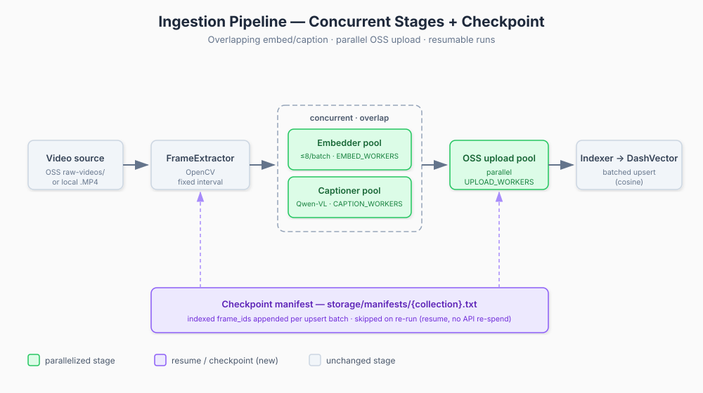

# aliyun-rag-video-search

RAG semantic search over egocentric kitchen video (EPIC-KITCHENS-100), built end-to-end on
Alibaba Cloud. Frames are extracted from video, captioned with Qwen-VL, embedded with a
multimodal model, and stored in DashVector for **text → image** vector search with metadata
filtering.

All AI services are Alibaba Cloud (DashScope 百炼 + DashVector), with a serverless deployment
to Function Compute (FC) in the Singapore region.

## How it works

```
              Ingestion                                    Query
  video.mp4                                       "take cup from cupboard"
     │                                                       │
     ▼                                                       ▼
  FrameExtractor (OpenCV, fixed interval)            Retriever._embed_text
     │  frames                                        (same embedding model)
     ▼                                                       │
  Embedder  (DashScope MultiModalEmbedding, 1152-dim)        ▼
     │                                               DashVector ANN query
     ▼                                                + scalar filters
  Captioner (Qwen-VL → structured JSON:                      │
     │       objects/actions/lighting/                       ▼
     │       occlusion/is_anomaly)                  client-side array filter
     ▼                                               (objects / actions)
  upload frames → OSS                                        │
     │                                                       ▼
     ▼                                                  top-k results
  Indexer → DashVector upsert
```

Two flows share the `pipeline/` package. A `FrameMetadata` dataclass carries state across
every ingestion stage. See [CLAUDE.md](CLAUDE.md) for the detailed architecture, including the
hybrid (server-side scalar + client-side array) filtering design.

### Ingestion performance



Ingestion is parallelized end-to-end: **embedding and captioning overlap** (they write disjoint
`FrameMetadata` fields), frames **upload to OSS in parallel**, and indexed `frame_id`s are
appended to a **checkpoint manifest** (`storage/manifests/{collection}.txt`) so interrupted runs
resume without re-spending on the DashScope APIs. Concurrency is tunable via `EMBED_WORKERS`
(default 4), `CAPTION_WORKERS` (8), and `UPLOAD_WORKERS` (8). On the query side, repeated query
text is embedding-cached and array-filtered searches adaptively over-fetch to fill `top_k`.

## Quick start

```bash
# 1. Install
pip install -r requirements.txt

# 2. Configure
cp .env.example .env        # fill in DASHSCOPE_API_KEY, DASHVECTOR_API_KEY, DASHVECTOR_ENDPOINT

# 3. Verify cloud connectivity
python test_connectivity.py

# 4. Run the search UI
streamlit run app.py
```

### Ingest your own data

```bash
# extract → embed → caption → upload to OSS → index
python scripts/ingest_epic.py --fps 2.0 --force --collection scene_frames_2fps
```

Captioning runs concurrently (Qwen-VL has no batch API); tune with `CAPTION_WORKERS=8`.

### Evaluate retrieval quality

```bash
python tests/test_evaluation.py                                    # recall@k, MRR vs EPIC ground truth
DV_COLLECTION_NAME=scene_frames_2fps python tests/test_evaluation.py
```

## Deployment

`deploy/` contains a Serverless Devs config (`s.yaml`, FC v3 custom-container) and Dockerfiles
for the ingest and query functions. See [deploy/README.md](deploy/README.md) for the full
serverless deployment guide (OSS trigger → ingest pipeline; HTTP `GET /search` → query service).

## Layout

| Path | Purpose |
|:---|:---|
| `pipeline/` | Shared stages: frame extraction, embedding, captioning, indexing, retrieval, filtering |
| `app.py` | Streamlit search UI |
| `scripts/ingest_epic.py` | Local end-to-end ingestion |
| `data/epic_loader.py` | EPIC-KITCHENS-100 annotation loader (ground truth) |
| `schema.py` / `config.py` | DashVector collection schema / centralized env config |
| `deploy/` | Serverless Devs config + FC handlers + Dockerfiles |
| `docs/` | Design docs (ego-centric roadmap, LoRA fine-tuning plan, architecture diagram) |

## Built with

This project was developed with the help of multiple coding agents:

- **DeepSeek V4 Pro**
- **GLM 5.2**
- **Claude Opus 4.8**

## License

See repository for license details.
